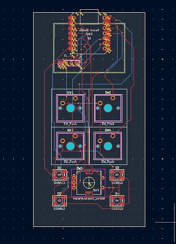

# Accessory-Keypad
-- 
Its a accessory keypad made for all pourpuss use like coding, 3D Modeling, PCB Dezining, gaming and much more if u programe this in your own way.
---

##

  

## Features

- It has 4 fore buttons which does different task
- It has rotating thing which will help u control values prisizely 
- it has severalmode like coding, 3D Modeling, PCB Dezining, gaming and can be costamized in will.

## Use of AI
- To bug fix
- To helpme guied my poject

## License

MIT License

## Credits

- Programed by [Srinjoy Das](https://github.com/srinj-ai)
---
