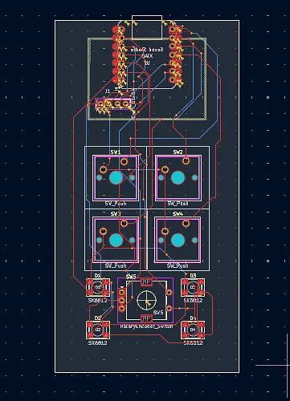

# Accessory Keypad (Hakpad)

A custom macro keypad designed for all your productivity and creative needs—whether it's coding, 3D modeling, PCB design, or gaming. Fully customizable to fit your exact workflow.

---

<p align="center">
  
</p>

---

## Features

- **4 Programmable Keys:** Dedicated mechanical switches for custom shortcuts, macros, or quick actions.
- **Rotary Encoder:** Precision control knob ideal for fine value adjustments, scrolling, brush resizing, or volume control.
- **0.96" OLED Display:** Displays current mode, active key bindings, or custom status.
- **Multi-Mode Support:** Switch seamlessly between tailored modes for coding, 3D modeling, PCB design, and gaming.
- **Fully Customizable:** Rebind keys and rotary controls to match your personal setup and workflow.

---

## Bill of Materials (BOM)

| Component | Quantity |
| :--- | :---: |
| Seeed Studio XIAO RP2040 | 1 |
| MX-compatible mechanical switches | 4 |
| MX keycaps | 4 |
| EC11 rotary encoder | 1 |
| Encoder knob | 1 |
| 0.96" SSD1306 OLED display (128×64, I2C) | 1 |
| USB-C cable | 1 |

*For complete details, see [`materials.txt`](materials.txt).*

---

## Repository Structure

```
.
├── assets/
│   └── pcb.webp
├── case/
│   ├── plate.3mf
│   └── tray.3mf
├── pcb/
│   ├── hakpad.kicad_pcb
│   ├── hakpad.kicad_sch
│   └── hakpad-F_Silkscreen.zip
├── LICENSE
├── README.md
└── materials.txt
```

---

## Customization

Since the project is powered by the Seeed Studio XIAO RP2040, you can program it using standard RP2040 firmware frameworks (such as QMK, KMK, CircuitPython, or Arduino). Custom keymaps and display routines can be configured to match your specific application requirements.

---

## Use of AI

- Bug fixes and troubleshooting.
- Guidance throughout project planning and implementation.

---

## License

This project is licensed under the [MIT License](LICENSE).

---

## Credits

- Designed and programmed by [Srinjoy Das](https://github.com/srinj-ai)

